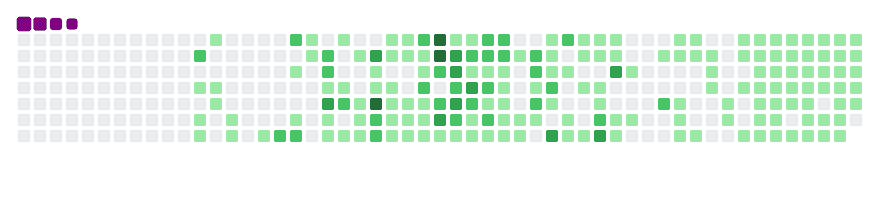

# Hey Everybody !  

# **👋👋 I'm Neeschal Dahal **

<h3 align="center">Tech Hunter from Nepal , who is learning App Development .</h3>

  

- 🔭 **I don't want you to know what I am working on !**

- 👨‍💻 My Portfolio **[http://nees.eu5.net](http://nees.eu5.net)**

- 💬 Ask me about **typescript, dart, cpp , python**

- 📫 My contact email **officialneeschalyt@gmail.com**

- ⚡ Fun fact **basically programmers don't have girlfriend but I do :)**

#

## Connect with me :

<h2 align="left">Languages and Tools:</h2>

 </a>                                                

## Softwares

> .
>    <a href="https://www.blender.org/" target="_blank" rel="noreferrer"> 

</img>

</img>

<h3 align="left">Support:</h3>

  
